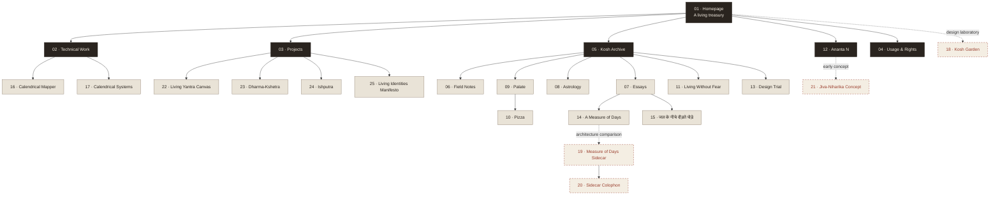
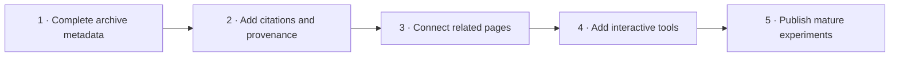

# Kosh site pages

Current inventory: **25 visitor-facing pages**.

Generated from the local production build on 15 September 2026. Links below use the local Astro address `http://127.0.0.1:4321`.

## Main site

1. [Homepage — Kosh](http://127.0.0.1:4321/)
2. [Technical Work — Texts & Systems](http://127.0.0.1:4321/technical-work/)
3. [Projects — Origins & Implementations](http://127.0.0.1:4321/projects/)
4. [Usage & Rights](http://127.0.0.1:4321/rights/)

## Kosh journal and collections

5. [Kosh archive](http://127.0.0.1:4321/blog/)
6. [Field Notes & Index](http://127.0.0.1:4321/blog/notes/)
7. [Essays collection](http://127.0.0.1:4321/blog/essays/)
8. [Calendrics & Celestial Symbolism](http://127.0.0.1:4321/blog/astrology/)
9. [Palate](http://127.0.0.1:4321/blog/cooking/)
10. [Pizza — Palate recipe](http://127.0.0.1:4321/blog/cooking/pizza/)
11. [Living Without Fear — Reading Notes](http://127.0.0.1:4321/blog/reading-notes/fear/)
12. [Ananta N](http://127.0.0.1:4321/blog/ananta-nihara/)
13. [Design Trial](http://127.0.0.1:4321/blog/design-trial/)

> The `/blog/` routes may display the private-blog password gate in a new browser session.

## Published essays

14. [A Measure of Days](http://127.0.0.1:4321/essays/a-measure-of-days/)
15. [जल के नीचे दौड़ते घोड़े](http://127.0.0.1:4321/essays/jal-ke-neeche-ghode/)

## Archive

16. [Calendrical Mapper](http://127.0.0.1:4321/archive/calendrical-mapper/)
17. [Calendrical Systems](http://127.0.0.1:4321/archive/calendrical-systems/)

## Design experiments

18. [Kosh Garden](http://127.0.0.1:4321/experiments/kosh-garden/)
19. [A Measure of Days — full sidecar edition](http://127.0.0.1:4321/experiments/a-measure-of-days/)
20. [A Measure of Days — sidecar colophon](http://127.0.0.1:4321/experiments/a-measure-of-days/colophon/)
21. [Jiva-Niharika concept](http://127.0.0.1:4321/blog-concept/)

## Standalone visual pages

22. [Living Yantra Canvas](http://127.0.0.1:4321/canvas/)
23. [Dharma-Kshetra — The Arrow of Duty](http://127.0.0.1:4321/dharma-kshetra/)
24. [Ishputra](http://127.0.0.1:4321/ishputra/)
25. [Living Identities Manifesto](http://127.0.0.1:4321/living-manifesto/)

## Utility routes

These are generated by the site but are not counted among the 25 visitor-facing pages:

- [404 page](http://127.0.0.1:4321/404.html)
- [robots.txt](http://127.0.0.1:4321/robots.txt)
- [sitemap.xml](http://127.0.0.1:4321/sitemap.xml)

---

## Site-wide flowchart

Solid lines describe the intended visitor journey. Dotted lines lead to experimental or comparative implementations.

## Page-by-page flow and content roadmap

### 01. [Homepage — Kosh](http://127.0.0.1:4321/)

**Current flow:** Mounted-image hero → entry actions → realm ledger → guiding thought → correspondence.

**Prospective content:** A small “recently tended” strip; one highlighted essay or project; a quiet current-status note showing what is being researched now.

### 02. [Technical Work — Texts & Systems](http://127.0.0.1:4321/technical-work/)

**Current flow:** Editorial hero → research position → technical fields → selected systems and studies → onward links.

**Prospective content:** Methodology and tools used; a visual research pipeline; downloadable datasets or notebooks; brief evidence and outcome blocks for each study.

### 03. [Projects — Origins & Implementations](http://127.0.0.1:4321/projects/)

**Current flow:** Monumental hero → image band → operating method → project dossiers → closing proposition.

**Prospective content:** Live-demo and repository links; project status and last-updated dates; constraints, outcomes, and lessons; before-and-after visuals for completed work.

### 04. [Usage & Rights](http://127.0.0.1:4321/rights/)

**Current flow:** Rights statement → permitted uses → restrictions → contact path.

**Prospective content:** Per-asset licence table; attribution examples; font and image provenance; a short permissions FAQ and commercial-use request form.

### 05. [Kosh Archive](http://127.0.0.1:4321/blog/)

**Current flow:** Archive introduction → realm gateways → collection navigation.

**Prospective content:** Recently tended entries; chronological archive; subject and format filters; a visual map connecting notes, essays, projects, and sources.

### 06. [Field Notes & Index](http://127.0.0.1:4321/blog/notes/)

**Current flow:** Editorial index hero → field-note premise → note catalogue → individual paths.

**Prospective content:** Seedling/growing/evergreen maturity labels; backlinks; date and subject filters; marginal annotations and “related fragments” under every note.

### 07. [Essays Collection](http://127.0.0.1:4321/blog/essays/)

**Current flow:** Editorial hero → statement on slower attention → selected-writing library → essay links.

**Prospective content:** Reading time and publication state; thematic series; short author notes; featured quotations; an essay-to-source relationship map.

### 08. [Calendrics & Celestial Symbolism](http://127.0.0.1:4321/blog/astrology/)

**Current flow:** Celestial hero → epistemic preface → three-room atlas → image plates → cautionary coda.

**Prospective content:** A legend separating observation, tradition, and interpretation; source bibliography; interactive sky/calendar diagrams; terminology glossary.

### 09. [Palate](http://127.0.0.1:4321/blog/cooking/)

**Current flow:** Visual cover → recipe-card index → technique notes → taste logs.

**Prospective content:** Seasonal index; pantry notes; ingredient provenance; failures and adjustments; links between recipes sharing the same technique.

### 10. [Pizza — Palate Recipe](http://127.0.0.1:4321/blog/cooking/pizza/)

**Current flow:** Full-colour kitchen hero → recipe title → editorial thesis → ingredients → five-step method → return to Palate.

**Prospective content:** Dough hydration and fermentation variants; oven-temperature comparison; preparation timeline; troubleshooting; printer-friendly recipe card.

### 11. [Living Without Fear — Reading Notes](http://127.0.0.1:4321/blog/reading-notes/fear/)

**Current flow:** Image quotation → opening reflection → Upaniṣadic duality → visual pause → Mahābhārata restraint → conclusion.

**Prospective content:** Full citation cards; Sanskrit terms with transliteration; translation comparison; personal commentary separated from source notes; related-reading trail.

### 12. [Ananta N](http://127.0.0.1:4321/blog/ananta-nihara/)

**Current flow:** Threshold → atmospheric inner-world room → fragments and visual inquiry → return.

**Prospective content:** A short orientation to the name; dated dream or perception fragments; recurring symbols index; audio atmospheres; links back to analytical essays.

### 13. [Design Trial](http://127.0.0.1:4321/blog/design-trial/)

**Current flow:** Trial title → isolated design demonstration.

**Prospective content:** Experiment objective; typography specimens; component states; responsive comparisons; decision log explaining what should or should not enter the main system.

### 14. [A Measure of Days](http://127.0.0.1:4321/essays/a-measure-of-days/)

**Current flow:** Garden hero → prologue → first clock → chosen world → cosmic interlude → ritual → discipline → return → what grows beside us.

**Prospective content:** Sources and footnotes; calendrical comparison diagram; personal field observations; audio reading; a link into the interactive mapper.

### 15. [जल के नीचे दौड़ते घोड़े](http://127.0.0.1:4321/essays/jal-ke-neeche-ghode/)

**Current flow:** जल-प्रवेश → भीतर की गति → प्रेम का अभ्यास → संवेदनशील मन → पाण्डुलिपि और अस्त्र → वन और भय → उजले अश्व.

**Prospective content:** कठिन शब्दों की छोटी शब्दावली; स्रोत और उद्धरण; लेखक की टिप्पणी; ध्वनि-पाठ; हिन्दी और अंग्रेज़ी के बीच वैकल्पिक समानांतर पठन.

### 16. [Calendrical Mapper](http://127.0.0.1:4321/archive/calendrical-mapper/)

**Current flow:** Project introduction → calendrical problem → mapping approach → technical record.

**Prospective content:** Date input → normalized astronomical value → calendar conversions → uncertainty notes; example journeys; downloadable conversion data and API documentation.

### 17. [Calendrical Systems](http://127.0.0.1:4321/archive/calendrical-systems/)

**Current flow:** Monumental archive hero → research premise → manuscript plate → long-form study → entry metadata.

**Prospective content:** Side-by-side system table; epoch and intercalation timeline; geographic map; primary-source excerpts; explicit claim-confidence markers.

### 18. [Kosh Garden](http://127.0.0.1:4321/experiments/kosh-garden/)

**Current flow:** Graphic garden hero → four paths → editor’s letter → about the author → selected work → articles → garden footer.

**Prospective content:** Replace demonstration entries with live collections; “now” and changelog panels; RSS/newsletter gateway; richer project previews and archive search.

### 19. [A Measure of Days — Sidecar Edition](http://127.0.0.1:4321/experiments/a-measure-of-days/)

**Current flow:** Cinematic hero → overture → agreement → cosmos → ritual → ledger → proposition → rings → closing wish.

**Prospective content:** Scholarly footnotes and citations; section index with reading progress; diagram plates; original-language source fragments; performance comparison with the Astro edition.

### 20. [Sidecar Colophon](http://127.0.0.1:4321/experiments/a-measure-of-days/colophon/)

**Current flow:** Colophon label → title → architecture and design notes → licensing note → return to essay.

**Prospective content:** Build-system diagram; exact asset provenance; font licence matrix; accessibility choices; performance figures and known limitations.

### 21. [Jiva-Niharika Concept](http://127.0.0.1:4321/blog-concept/)

**Current flow:** Atmospheric portal → concept identity → visual environment.

**Prospective content:** Purpose and relationship to Ananta N; interaction instructions; motion and accessibility controls; a path into finished fragments rather than remaining a visual dead end.

### 22. [Living Yantra Canvas](http://127.0.0.1:4321/canvas/)

**Current flow:** Canvas entrance → generative visual field → interactive controls.

**Prospective content:** Presets with symbolic explanations; save/export image; shareable states; keyboard guidance; a gallery of visitor-generated compositions.

### 23. [Dharma-Kshetra — The Arrow of Duty](http://127.0.0.1:4321/dharma-kshetra/)

**Current flow:** Immersive hero → I. The Despair → II. The Truth → III. The Release.

**Prospective content:** Verse citations and translations; contextual commentary; chapter navigation; optional recitation; a final reflection prompt connected to field notes.

### 24. [Ishputra](http://127.0.0.1:4321/ishputra/)

**Current flow:** Manuscript sheet → title → compact textual presentation.

**Prospective content:** Etymology and context; source genealogy; sectioned argument; archival image plates; notes distinguishing history, theology, and personal interpretation.

### 25. [Living Identities Manifesto](http://127.0.0.1:4321/living-manifesto/)

**Current flow:** Manifesto entrance → identity proposition → principles → closing position.

**Prospective content:** Version history; concrete examples; reader responses; related essays; downloadable plain-text edition and a public record of revisions.

## Suggested editorial sequence

1. Begin with dates, status, authorship, citations, image provenance, and reading time.
2. Add explicit relationships among notes, essays, archive studies, and projects.
3. Complete the Calendrical Mapper and Living Yantra Canvas as the two principal interactive tools.
4. Promote an experiment only when its content, mobile layout, accessibility, and licensing are ready.
